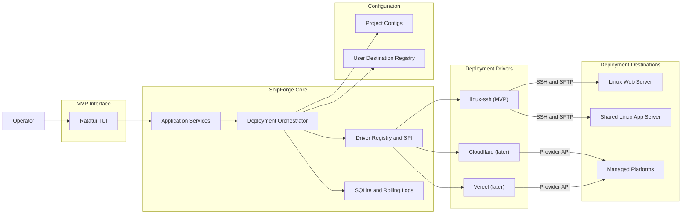
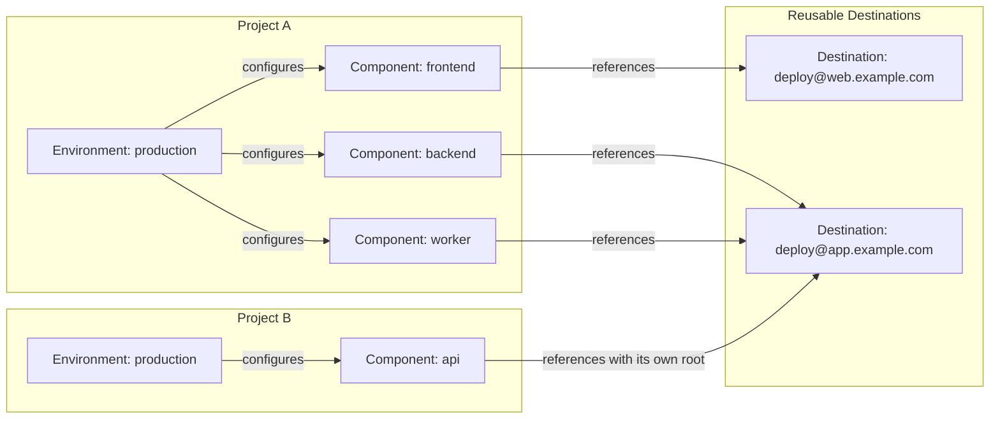

# ShipForge Architecture

> Product correction, 2026-09-07: [Deployment responsibility contract](deployment-contract.md) supersedes mandatory releases/current layout and migration assumptions. The existing implementation described below awaits replacement for in-place publishing. Do not migrate user applications to satisfy it. Runtime data and database backup/restore are outside scope; retain only the previous application archive for failed-deployment recovery.

## Goals and Boundaries

Explicit service argv `sudo -S -- <program> ...` opts into saved-login-password sudo authentication. A pinned authenticated session retains only a protected password reference; it decrypts on a bounded stderr prompt and sends one stdin line followed by EOF. No server authorization is added. Password-channel output is suppressed before logging (including interruption settlement), while exit status and conservative unknown-outcome handling remain authoritative. Ordinary commands, key/Agent authentication, frozen service command schema and retention are unchanged. Preflight validates credential availability/format without running privileged commands; existing sudo policy is enforced by the server at execution.

SSH password authentication uses the same pinned `russh` handshake as private keys and SSH Agent. The TUI keeps bounded, masked, non-serializable password drafts. `SshCredential::Password` contains only Windows current-user DPAPI ciphertext; authentication decrypts it after Host Key verification, and connection persistence retains the existing confirmed-authentication/atomic-registry rules. Failure to decrypt has no plaintext or alternate-identity fallback. Passwords do not enter Driver target snapshots, project configuration, command diagnostics or history. Keyboard-interactive/MFA is outside this password feature. The local credential schema adds a password variant; older binaries cannot read registries containing it.

ShipForge is a local Rust executable that builds Components and deploys them through capability-based Drivers. The MVP client supports Windows x64 GNU only and is verified locally with the existing Rust/MinGW toolchain; GitHub stores repository commits, not test runs. Linux/macOS client code and historical evidence do not establish supported platforms. A reusable Destination may be a Linux host reached by SSH or, after the MVP, a managed platform account; each Environment configures its Components directly with a Destination and deployment settings.

The MVP ships only the built-in `linux-ssh` Driver. Each Component selects exactly one Destination in an Environment, while several Components may reuse the same Destination with independent roots. One Component cannot be replicated across Destinations; rolling rollout, distributed atomicity, multi-process deployment coordination, external Driver plugins, AI Agent control, and automated database rollback are outside the MVP. AI Agent support is frozen: the MVP reserves no adapter, schema, protocol, or roadmap work package for it. SSH Agent remains only an authentication option.

Configurable remote Service Commands are implemented in `linux-ssh`, with systemd as a built-in Service Preset over the same executor. `SVC-01` covers configuration schema 2, TUI editing, lifecycle commands, health checks and frozen recovery evidence. Package validation precedes `QA-02` and final release gates; remote dependency installation remains outside scope.

## System Shape



The orchestrator owns Deployment status, Destination resolution, local build, canonical Release packaging, durable intent, ordered events, cross-Component sequencing, common health policy, and history. A Driver owns destination authentication, preflight, transfer or provider submission, activation, observation, rollback, remote logs, and cleanup. SSH/SFTP and vendor APIs are Driver implementation details, not application-layer protocols.

## Driver Contract

The internal Rust SPI is capability-based. Its conceptual contract is:

```rust
trait DeploymentDriver {
    fn kind(&self) -> DriverKind;
    fn static_capabilities(&self) -> DriverCapabilities;
    async fn preflight(&self, ctx: &ComponentExecutionContext) -> PreflightReport;
    async fn plan(&self, ctx: &ComponentExecutionContext,
        request: &ComponentRequest) -> ComponentPlan;
    async fn current(&self, ctx: &ComponentExecutionContext) -> Option<ReleaseRef>;
    async fn inventory(&self, ctx: &ComponentExecutionContext) -> ComponentInventory;
    async fn prepare(&self, deployment: &DeploymentId,
        ctx: &ComponentExecutionContext, plan: &ComponentPlan,
        package: &ReleasePackage, events: &dyn EventSink)
        -> PreparedRelease;
    async fn activate(&self, deployment: &DeploymentId, ctx: &ComponentExecutionContext,
        release: &ReleaseRef) -> ActivationReceipt;
    async fn rollback(&self, deployment: &DeploymentId, ctx: &ComponentExecutionContext,
        expected_current: Option<&ReleaseRef>, target: Option<&ReleaseRef>) -> ActivationReceipt;
    async fn logs(&self, ctx: &ComponentExecutionContext,
        release: &ReleaseRef) -> LogStream;
    async fn cleanup(&self, ctx: &ComponentExecutionContext,
        policy: &RetentionPolicy) -> CleanupReport;
}
```

Transport and SDK types—SSH sessions, SFTP handles, protocol errors, and provider request/response objects—remain inside a Driver. Application code receives only ShipForge-owned plans, events, errors, observations, Releases, and Release references. `ComponentExecutionContext` has a common identity envelope plus opaque credential and validated-target handles. Only `linux-ssh` interprets host/port/user/Host Key, root, systemd, and destination-side health settings; the application layer neither reads nor copies those fields into its domain model. `ReleaseRef` persists only common identity, version, Destination, endpoint and capability fields; package receipts separately retain the manifest, digest and size. Provider-specific IDs or SDK objects are not added to the MVP contract.

This boundary also applies to presentation and project configuration. The TUI says “SSH connection” and “deployment target”; `shipforge.yaml` contains no Driver field, capability identifier, transport option, or provider object. The user-level registry retains a private implementation tag so the program can select compiled code. Internal type names and diagnostic step IDs may identify a Driver, but ordinary TUI labels and Project YAML do not.

The implemented Driver advertises staged deployment, explicit activation, observation, inventory, rollback, retention, and cancellation. Remote logs are not advertised yet. Local build and Release packaging are common application services, not Driver capabilities. Static capabilities are narrowed by preflight for the resolved Component target, and planning fails early when a required capability is absent. Provider build, preview URLs, promotion, and traffic splitting are designed only when the first managed-platform Driver is implemented.

Fingerprint capture and authenticated SSH sessions use the same client configuration with TCP `nodelay` enabled for latency-sensitive sequential exchanges. TCP connect, SSH handshake/Host Key verification, credential loading and user authentication consume one absolute connection deadline; fixed phase labels identify where that shared budget expired without exposing parser, key or protocol diagnostics.

The supported `IdentityFile` contract is a bounded regular local file of at most 1 MiB. The final file cannot be a symbolic link, special file or Windows reparse point; obvious Windows UNC/device paths are also rejected. Metadata, open, read and decode run on one process-wide, single-flight OS thread so an expired connection deadline and Tokio runtime shutdown do not wait for a blocking filesystem call. Rust cannot safely terminate that thread; a permanently stalled read may retain the sole loader permit until process exit, causing later `IdentityFile` attempts to time out instead of accumulating workers. Unix opens use no-follow/nonblocking flags, while Windows accepts a direct absolute drive-shaped path and verifies the opened handle metadata. A mapped drive, network mount or reparse point in a parent directory cannot be reliably distinguished here and remains outside the supported contract rather than being claimed as rejected.

Remote command cancellation and timeout retain the SSH channel long enough to accept an already-known exit status, then attempt TERM, KILL and channel close within a separate one-second cleanup bound. A server that ignores signals may still leave the remote outcome unknown; the original cancellation/timeout classification is retained rather than reporting cleanup as command success. All other protocol defaults and the existing Host Key checks remain unchanged.

Drivers are compiled into the executable and selected by the referenced Destination kind. Dynamic plugins and external Driver processes are outside the MVP and have no reserved protocol.

## Configuration Shape

The human-facing configuration rules are defined in `docs/configuration-guide.md`. The Project root contains one `shipforge.yaml`: concise user intent plus a TUI-maintained `_shipforge` section for stable Project/Environment identity, per-Component generation, and normalized target metadata such as the `linux-ssh` resolved root. The user-level registry records reusable Destination connections. Each Environment maps its Components directly to those Destinations.

The Project file lives at the selected Project root and is the sole source of Project identity and Project-specific deployment intent. The local Project registry stores only canonical root paths and recent-project metadata. Opening a root with a valid `shipforge.yaml` loads it directly; a missing file always starts new-Project setup and generates new identities. A present file with missing or invalid `_shipforge` metadata is rejected and may be reinitialized with new identities only after explicit user confirmation. Neither local cache nor remote state reconstructs Project configuration. Setup is selection-first: repository discovery proposes Components and builds, simple direct SSH config blocks propose connection values, and an authenticated Driver preflight proposes remote paths and services. Destination IDs and credential handles are generated automatically; credentials remain user-local and are never copied into the Project file.

The model keeps deployment stages separate from reusable infrastructure connections:



Destination connections live in the user's platform configuration directory, are reusable across Projects, and are managed by the TUI connection page rather than copied into Project files. The setup wizard can select an SSH config Host or create a connection through form fields and a Key picker.

Project configuration uses names and one canonical form; generated immutable Project/Environment IDs plus per-Component generations and resolved default roots live in `_shipforge`. YAML mapping order has no execution meaning, and optional Component `after` dependencies are topologically sorted with deterministic tie-breaking. The following example uses schema 2:

```yaml
schemaVersion: 2

_shipforge:
  projectId: prj_01J8MALL4Y2K6M7P
  environments:
    production:
      id: env_01J8PROD8V5F3Q1N
      components:
        frontend:
          generation: 1
          resolvedRoot: /srv/shipforge/mall/production/frontend
        backend:
          generation: 1
          resolvedRoot: /srv/shipforge/mall/production/backend
        worker:
          generation: 1
          resolvedRoot: /srv/shipforge/mall/production/worker

project: mall

components:
  frontend:
    build:
      - [npm, run, build]
    artifact: dist

  backend:
    build:
      - [cargo, build, --release]
    artifact: target/release/api

  worker:
    build:
      - [cargo, build, --release]
    artifact: target/release/worker

environments:
  production:
    components:
      frontend:
        to: dst_00000000000000000000000000000001
      backend:
        to: dst_00000000000000000000000000000002
        service:
          start:
            - [systemctl, restart, --, mall-api.service]
          stop:
            - [systemctl, stop, --, mall-api.service]
          check:
            kind: systemd
            unit: mall-api.service
        health: http://127.0.0.1:8080/health
      worker:
        to: dst_00000000000000000000000000000002
        service:
          start:
            - [systemctl, restart, --, mall-worker.service]
          stop:
            - [systemctl, stop, --, mall-worker.service]
          check:
            kind: systemd
            unit: mall-worker.service
```

The TUI writes one canonical YAML shape: `build` is always an ordered list of argv arrays, and `artifact` is always one relative path. The configuration layer applies defaults and creates typed values before invoking application services or Drivers. Build-output type is detected after the build and frozen into the Deployment Plan without another user field. Project, Environment, Destination, credential, Deployment, and Release identifiers are generated by the application and never derived from display text. Invalid references, paths, cycles, or managed metadata never mutate `shipforge.yaml`. Only a user-confirmed TUI edit atomically replaces the file.

Destination configuration is a versioned tagged union validated internally by its Driver. A system-generated immutable Destination ID identifies the connection; the TUI derives its display text from the endpoint. Referenced non-secret revisions remain available for historical observation and cleanup, while credentials resolve through current handles. Secret values are never serialized into Project configuration or plans. Each Environment/Component entry selects a Destination ID and provides only concise deployment settings. For `linux-ssh`, those settings include root, service activation, and health checks. Its default root is `/srv/shipforge/<project>/<environment>/<component>` and is materialized into `_shipforge`, so later Project or Environment renames do not retarget it. Changing the selected Destination or target settings increments the Component generation; editing the Destination connection itself creates a new Destination revision.

## Rust Layout

```text
src/
├── main.rs              # composition root, TUI startup, terminal restoration
├── tui/                 # ratatui views, input, bounded projection
├── application/         # orchestration, rollback, recovery, queries
├── domain/              # deployments, releases, destinations, components
├── drivers/
│   └── linux_ssh/       # MVP Deployment Driver
├── config/              # project config + Destination registry resolution
├── projects/            # local project registry
├── history/             # durable journal, logs, reconciliation
└── telemetry/           # ordered events and redaction
```

Application code depends on the Driver SPI, never on `linux_ssh`, SSH/SFTP, or vendor clients. Drivers may reuse low-level HTTP, process, archive, and credential adapters.

## Domain Lifecycles

A **Deployment** is an attempted change to one or more selected Components in an Environment. It exists before building and records each Component plan and outcome:

```text
created → running → succeeded
                  ├→ failed
                  └→ cancelled
```

Detailed progress is expressed by common and Driver-namespaced Steps. The configured `artifact` is one file or directory build-output path. The core Packager turns it into exactly one canonical deployable product: an immutable `<version>.tar.gz` **Release** for one Component, containing a minimal manifest and verified by SHA-256. The manifest contains stable identity, version, creation time, and source revision; archive size and digest are computed from the final bytes and stored beside the manifest data in the Release receipt, avoiding a self-referential digest. Drivers consume that Release and never create an alternative core package. A Deployment can produce several Releases, but it is not itself a Release and does not create an Environment snapshot. Each Component independently has a current Release or no deployed Release.

Cross-Component runtime dependencies use optional `after` edges within one Environment. The planner restricts the graph to the selected Components and sorts it with deterministic tie-breaking; an unselected dependency is not deployed automatically. The MVP prepares every selected Release first and, on failure, compensates already activated Components in reverse actual activation order. Environment Observation is a simple map from each configured Component to its observed current Release or `not_deployed`; it makes no environment-wide atomicity claim.

The application orchestrator accepts frozen Component plans, sealed Release packages and exact activation order, rejecting mismatched inputs before creating a Deployment. Every prepare, activation and compensation call has a durable intent. Activation errors trigger a fresh observation, but a Driver's `recovery_blocked` result takes precedence: an unknown service-command outcome cannot authorize another command on that Component merely because current matches. Known applied changes may be compensated with independent tokens; earlier successful Components still recover in reverse order. Reports retain observed versions, unknown service state and manual guidance separately.

Automatic compensation remains part of the failed or cancelled Deployment. An explicit rollback creates a separately linked Rollback Deployment, preflights every selected Component before changing anything, then processes the selected dependency graph in reverse activation order. Each target is either a frozen historical `ReleaseRef` or `not_deployed`; the Driver also receives the expected source, so absence is checked rather than treated as a wildcard. A partial rollback failure is observed with an independent bounded token; observation errors remain unknown and include manual guidance, never a fabricated `not_deployed` result. SQLite schema v5 preserves operation type, source Deployment links, nullable rollback targets and the bounded log index, while adding the local history model below.

The TUI deployment service freezes Git branch/revision/worktree status and the selected configuration for confirmation. It creates the Deployment and build intent before invoking any build, then uses that same ID for preparation, activation, compensation and logs. Before each Driver mutation, a wrapper revalidates the saved Project and selected Destination snapshots; read-only observation of the frozen endpoint remains available after configuration drift. Terminal input/render errors request cancellation and wait for the running operation before closing the runtime.

## Linux SSH Driver

The first driver implements the existing agentless Linux workflow:

```text
local build → tar.gz + SHA-256 → SFTP temporary upload
→ versioned Component Release archive → extracted version directory
→ atomic Component current symlink → service activation → health checks
```

```text
<component.root>/
├── .shipforge-project.json
├── current -> releases/<version>/
├── archives/<version>.tar.gz
├── releases/<version>/
│   ├── manifest.json
│   └── <extracted payload>
├── temporary/<deployment-id>.tar.gz
└── metadata/{deployments,releases}.jsonl
```

The Driver verifies SSH Host Keys, remote tools, hashes, paths, disk, permissions, endpoint fingerprints, Component generations, and same-filesystem activation. `.shipforge-project.json` is a static Deployment Marker containing Project/Environment IDs, Component name, and generation; preflight rejects a conflict. It is not application configuration or a runtime dependency. Before preparation writes, the Driver rechecks `current` against the frozen plan and estimates peak storage from the existing archive's actual entries, remote block size, and metadata reserve. This is a point-in-time check, not a space reservation. Marker, path ancestors and internal directories reject unsafe links; current and historical manifests must match identity and version. The Driver uploads the already packaged Release, verifies its digest, and hard-links the verified bytes into `archives/<version>.tar.gz` with no-clobber semantics. It extracts first into `temporary/<deployment>.dir`, validates the embedded manifest, then uses a same-filesystem no-clobber rename into `releases/<version>`. The sealed Prepare receipt is bound to that Deployment. Prepare never creates or rewrites the archive and does not touch `current`.

Prepare may create only recorded, disposable staged resources for candidate Releases. Those writes must be retryable or cleanable and must not change `current`, services, databases, or business state. Shared persistent-content mapping is outside the MVP. After atomically switching each selected Component's `current`, the Driver activates and checks it in normalized dependency order; unselected Components are untouched.

Filesystem activation is atomic per Component, not across Components or an Environment. Observation accepts only a non-dangling `current -> releases/<version>` link whose version directory is not itself a link. Activation verifies prepared archive/directory types and same-filesystem identity, checks expected current twice, then atomically renames its temporary link. Service completion and compensation use independent bounded tokens. Compensation re-observes current and refuses drift. Known command or health failures restore the prior version, or remove current and stop the first service. A service command without a confirmed exit status blocks automatic recovery of that Component; earlier successful Components still recover in reverse order.

For `linux-ssh`, health execution remains inside the Driver boundary. A configured systemd unit must first reach `active`; its `NRestarts` value becomes the baseline and may not increase during the stability window. A configured health URL is requested by remote `curl`, so loopback and private endpoints remain checkable, and only 2xx responses pass. Commands use structured arguments, bounded SSH output and bounded sanitized errors; URL arguments are marked sensitive in diagnostics. Service/check output is retained only after a known result and redacted by the application log sink before fragmentation; each stream is capped at 64 KiB with an explicit truncation notice. Internal probe output remains quiet. Timeout, interval, attempts and stability duration have safe built-in MVP defaults and bounded programmatic overrides. Cancellation stops waiting, then health verification invokes activation compensation with an independent token.

Every effect has a durable intent record before execution and an outcome afterward. Each Component activation remembers its prior `current` link, including absence. Restart or health failure invokes compensation inside the current Deployment. An explicit rollback uses a linked Rollback Deployment. The active TUI session refuses to start a second Deployment while one is running. Separate ShipForge processes are outside the supported operating model. Before an effect, the Driver verifies that the observed Destination revision, endpoint fingerprint, Component generation, and current version still match the plan; a mismatch stops the operation and asks the user to refresh.

### Service Commands and Presets

`SVC-01` replaces the dedicated systemd path inside `linux-ssh`, not the Driver SPI or Release/transfer model. A validated `ServiceConfig` is the shared command plan; the systemd preset supplies ordinary start/stop argv and its specialized active/NRestarts check. PM2 uses custom commands, not a separate Driver or automatic-discovery subsystem.

- Service Commands belong to each Environment/Component target in root `shipforge.yaml`, never the reusable Destination registry or local `build`. The TUI offers unmanaged, custom, and systemd-preset choices. Preset selection populates defaults; users need no new identifiers or duplicated lifecycle commands when one command can safely serve multiple phases.
- Lifecycle intent distinguishes first start, update, restoration of a prior version, and stopping a service when restoring `not_deployed`. The plan must establish the required recovery actions before any effect; missing actions are not guessed after a failure. Unmanaged targets retain filesystem-only behavior.
- Commands use executable/argv and an explicit execution-directory context, never implicit Shell text or unescaped substitutions. Forward activation uses the selected new version; restoration uses the restored version. Stopping after first deployment uses a validated context that still exists, not a removed `current` link. PM2 tests must prove the actual process uses the intended version, not just that a named restart returned zero.
- Use the authenticated SSH user and existing Host Key, bounded output, timeout, redaction, durable intent and safe-cancellation machinery. No automatic privilege escalation or runtime installation. Service commands are trusted user-authorized code, not a sandbox; they must not edit ShipForge metadata or perform database migrations. Preflight checks availability without executing service mutations.
- A side-effect command is not automatically retried after failure, disconnect or timeout. Keep known exit outcomes separate from unknown remote effects and filesystem observations; `current` matching cannot prove a restart succeeded. Recovery uses independent bounded execution and records partial failure/manual intervention rather than claiming arbitrary command effects are reversible.
- Optional command health probes must be read-only and bounded; zero exit means one passing probe, not permanent health. Required HTTP and configured command probes must pass; the systemd preset preserves its active/NRestarts stability window. Custom services do not inherit systemd checks. An omitted probe is not displayed as an executed verification.
- Freeze command, phase, directory and check settings in the confirmed plan and retain sufficient historical evidence for recovery. Integrate normalization, target-change validation and history compatibility in the same package. Existing `systemd` YAML needs a tested, TUI-confirmed conversion to one canonical shape, not silent rewrites or permanent aliases. Missing historical commands cannot be reconstructed from current configuration.

Canonical schema 2 uses `service.start` and `service.stop` (required ordered argv arrays), optional `update` (defaults to start), `restore` (defaults to effective update), and `check` (`kind: command` with argv, or `kind: systemd` with unit). Start/update run in the new real version directory, restore in the historical directory, and stop in the removed current's still-existing directory; command health checks use current. Each service action shares 120 seconds; a recovery service action gets an independent 120-second budget, excluding preceding path verification and link restoration. Read-only command probes use five attempts, one-second intervals and ten-second command limits. No check is added implicitly to a custom service.

The validated target exposes a bounded non-secret canonical snapshot plus whether missing legacy evidence forbids recovery. Application services retain/compare opaque snapshots without interpreting Linux fields. Local Component history gains optional `target_snapshot`; actual failed-command diagnostics gain optional `working_directory`, included in redaction, bounds, searches and diagnostic JSON. Existing records remain readable; missing commands remain unavailable, and old binaries are not promised to read new records. No SQLite table migration or remote metadata change is required. New Rollback plans reject changed snapshots even if generation was not changed; legacy service history without a snapshot cannot authorize commands. File-only legacy history retains its existing evidence rules.

Schema 1 is read only for TUI-confirmed conversion: legacy `systemd` becomes an equivalent service plan in memory, with deployment blocked until schema 2 preview/save. Equivalent conversion preserves IDs, generation and root; schema 2 rejects the legacy key. Changed commands/checks increment generation. Reads never silently rewrite YAML. See [configuration rules](configuration-guide.md) and [SVC-01 verification](validation/svc-01.md).

## Persistence and Recovery

### Remote inventory and audit

HIS-02 adds the read-only `inventory` SPI. `ComponentInventory` separates verified archive metadata from auxiliary audit records. The query requires the existing Project identity and resolved Component context; it never creates directories, repairs metadata, rebuilds YAML, or consults the local history database. Missing/empty unmarked roots yield no versions; nonempty unmarked or conflicting roots are rejected.

The SSH implementation scans archive and extracted-directory names, verifies canonical versions, regular non-link files, stable file identity, remote SHA-256 and gzip integrity, and the first bounded tar manifest. Existing extracted manifests must agree. Valid archive-only entries remain visible with `extracted=false` and an issue; directory-only, corrupt and unsafe entries are diagnosed. `current` explicitly distinguishes a version, confirmed absence and failed observation. None of these facts proves health or payload activation safety. Archive bytes stay on the server; only metadata is transferred. Scans are bounded to 1,024 combined namespace entries, 64 KiB per listing, 1 GiB per archive, 4 GiB aggregate archive bytes and 120 seconds. A limit, truncated listing, archive-command timeout or overall deadline fails the scan rather than returning an apparently complete subset. A failed current-only observation may return verified archive entries with explicitly unknown current.

`metadata/releases.jsonl` records successful preparations with manifest, digest and size. `metadata/deployments.jsonl` records Component activation and rollback phase outcomes, expected/target/observed versions, optional health evidence, Deployment ID, timestamp and the original non-secret Release reference. The rollback SPI is also used for compensation; these are Component events, not assertions that a whole multi-Component Deployment succeeded. A failed health check followed by internal restoration does not assert a new healthy observation. Historical Destination revisions, endpoint fingerprints and capabilities come only from actual records, never from current context or the manifest.

Append validates the marker and path ancestry, rejects symlink/shared-hardlink files, pins a verified file descriptor and uses append-only writes without truncation or locks. A leading newline isolates an earlier torn tail. Reads accept a bounded prefix (48 KiB per file, 8 KiB per line, 128 records total); identical event IDs deduplicate, conflicting IDs are excluded, and missing, malformed, unsupported or omitted evidence makes history explicitly incomplete. Missing audit never removes verified archive inventory. Audit data contains no connection settings, credentials, remote paths, URLs or raw command output. Preflight checks GNU `timeout`/`dd` features and read-only `/proc/self/fd` access before building or uploading; there is no new server runtime.

A Prepare audit failure stops before activation. After activation or rollback has taken effect, an audit failure adds a bounded, redacted warning without replacing the known receipt, suppressing compensation or triggering the local-durability failure policy below. Remote audit operations have a 30-second local deadline and a 25-second server deadline with a two-second kill grace. This auxiliary history is not a transaction log for recovery decisions; retention uses original local history for authority, and the TUI displays audit facts through explicit management inspections.

### Local journal

SQLite is authoritative for local Deployment intent, Steps, per-Component Release receipts and observations, logs, and recovery progress. Numbered migrations run transactionally and reject newer schemas. Deployment state updates use compare-and-set semantics; each external effect requires a pending intent row before execution and exactly one redacted outcome afterward. SQLite uses foreign keys, WAL, and full synchronous durability. Raw sanitized output drains into per-Deployment bounded rolling files; Unix database and log files use mode `0600`. UI notifications use bounded channels and may coalesce progress; terminal states and errors are never dropped.

HIS-01 implements these local schema v5 records:

| Tables | Evidence retained |
| --- | --- |
| `deployment_metadata` | Confirmed Git branch/revision/worktree state and best-effort local account label; missing values remain unknown |
| `deployment_snapshots`, `component_snapshots` | Atomic selected set, execution order, full target/prior refs, generation, Destination revision, endpoint and effective capabilities |
| `release_packages`, `release_receipts` | Exact core manifest, final digest/size, and validated Prepare references; no credentials, connection settings or temporary archive paths |
| `deployment_steps`, `operation_intents` | Planned phases and atomic intent/step start and completion, timings and sanitized diagnostics |
| `deployment_observations` | Append-only full observed refs, confirmed absence or explicit observation error, with timestamp, provenance and optional health evidence |

Plans are stored before building; each finished package is recorded before preparation. A prepared receipt never implies current or healthy state. A rejected activation receipt supplies no trusted health evidence; the orchestrator separately observes current. Unattempted steps become skipped at terminal transition, while unresolved started intents stay visible. Readers preserve legacy v1–v4 gaps instead of reconstructing missing history. `HistoryStore` provides Project/Environment-scoped pages (1–100 records), detail queries and an unresolved-operation query that also includes terminal Deployments with pending intents. The TUI accesses these internal APIs through the bounded HistoryQueryService described below.

Post-effect persistence failure stops further forward mutation without discarding the in-memory effect receipt. Compensation can proceed only after its own intent is durable; inability to journal one Component does not silently skip other independently journalable recovery. Reports retain known outcomes and local-history warnings even if saving the terminal result fails. A shared monotonic clock spans TUI build and orchestration so immediate setup failures cannot move timestamps backwards. This introduces no file lock, remote lock, new user field or background process.

Live build output is redacted across chunk boundaries before reaching disk or UI. A dedicated writer consumes a bounded 128-record queue; saturation or I/O failure requests safe cancellation and preserves the first diagnostic. Logs use a 1 MiB current file and up to three rotated files per Deployment. Final log failure is appended as a warning to an existing Deployment report and must not replace known outcomes or hide compensation failures. Search, filtering, copying and export use the local-log boundaries below, not a remote application-log capability.

Schema v7 adds `deployment_logs.format`: existing rows remain `legacy_text`, and new execution logs explicitly register `jsonl_v1`. The indexed format, never stdout resembling JSON, selects the decoder. Numbered write-side migration preserves old files and outcomes; history browsing refuses an older schema without migrating it. The fixed indexed path remains `logs/<Deployment>.log[.N]`. Structured records carry a version, monotonic elapsed time, optional actual Component/step scope, event kind and sanitized fields; complete JSON lines rotate as units. A long event has explicit fragment identity/index/count and is safely split into 16 KiB messages. Failed-command snapshots are limited to 128 arguments/16 KiB; unavailable or oversized snapshots are explicit, never shortened into apparently complete commands.

Each Driver defines how to observe actual Component state. For `linux-ssh`, each Component's `current` link, archive, extracted directory, and manifest are authoritative; JSONL is an audit aid. Future managed Drivers use provider APIs and external IDs. Given a valid `shipforge.yaml`, recovery compares durable local intent with Driver observations and may rebuild the Component Release inventory; it never reconstructs Project identity or configuration from remote data. A failed multi-Component Deployment keeps explicit results for every selected Component until compensation or manual repair completes.

ShipForge's responsibility ends after activation, health verification, durable result recording and this operation's optional retention pass. The SSH session is then closed and no resident control process remains. Application processes and system services do not read ShipForge metadata. A later ShipForge session reconnects and observes the static remote facts only when the user starts another deployment, rollback, or recovery action.

### Read-only reconciliation

`RecoveryService::inspect` accepts a valid saved Project, selected Environment/Components and an optional local Deployment. It uses only Driver `inventory`, not builds, Git, preflight, service commands or mutation methods. A source-backed inspection uses its exact historical Destination revision and endpoint; missing revisions never fall back to the latest connection. Changed generation or missing frozen target settings yields unknown without connecting. YAML and the selected registry revisions are checked before each read and before persistence.

Current alignment (target, prior version, other or unknown) is separate from package alignment. A package match requires the frozen manifest, SHA-256 and size; conflicting exact-target prepare audit evidence prevents a match. Archive-only, absent and invalid evidence remain distinct. Current matching a target cannot complete an old intent, prove service restart or establish health. Mixed target/prior Components suggest possible partial application, not its order or cause. Original Deployment/Step/Intent records remain unchanged.

Schema v6 adds `recovery_reports` and `recovery_report_components` for immutable observations and scoped cache lookup, plus `deployment_revisions` for local source freshness. Historical-table changes increment the revision in the same transaction. Inspection reads one bounded source snapshot, releases the transaction before networking, then compares its revision in the short report-write transaction. Changed source history/configuration or failed persistence leaves observations available with an explicit uncached warning. Cache-only inspection has no source-history revision to compare. Latest cache lookup follows local insertion order, not the wall clock, and a new unknown never silently revives an old successful observation.

A new database is created only when its file is missing; existing corrupt, empty or uninitialized history is rejected without replacement, including when changed during inspection. Cache-only reports create no Deployment, intent, receipt or log history. Audit records preserve their original endpoint, capabilities, timestamps and historical health; neither manifests nor current connection settings fill historical gaps. Lost local logs cannot be reconstructed. Reports are limited to 256 Components and 4 MiB, pages to 100 reports/8 MiB. The application budgets 2 MiB for accumulated evidence, marks uninspected/oversized Components unknown, and limits reads to 180 seconds per Component and 600 seconds overall.

The Linux inventory also diagnoses known upload, extraction, activation and rollback temporary names. Marker-publication leftovers are unattributed, not Deployment IDs or ownership proof. This separate no-follow scan has 256 entries, 64 KiB/listing, 32 notices and a 30-second deadline; unsafe/shared markers, changed listings and limits mean incomplete/unknown, never confirmed absence. No residue is removed or repaired.

Startup and valid-Project opening run a local-only attention query for `created/running OR pending intent`, including terminal Deployments with unresolved work. This query never creates a missing history database or parent directory, migrates schemas, or changes history rows; SQLite may create/use WAL/SHM sidecars for an existing WAL database. One background query plus one replaceable request keeps work bounded; stale UUID results and active-session results are suppressed. The TUI shows pending verification rather than declaring a crash or auto-connecting. Remote inspection shares the existing `DeploymentSession` gate. The management UI opens saved reports and explicit inspection/rollback workflows; subsequent corrective writes require new confirmation and durable intent, never replay of an old intent.

### Release retention

`RetentionRun` runs only after every selected Component succeeds and its results are persisted, while the original Deployment remains running. The TUI plan preview describes automatic cleanup; no YAML field, separate user form, schema migration or background task is added. Each target must advertise effective retention support. Keep the newest five manifest versions (creation time then version, descending), current, the latest distinct locally observed healthy version on the same endpoint, and references from unfinished operations or pending intents, including terminal parents. Health follows local insertion order, not wall-clock order; an older Destination revision on the same endpoint may still supply protection.

`HistoryStore::retention_history` reads one short consistent transaction, bounded to 4,096 rows/4 MiB per evidence class. It validates active snapshots/intents and package/health identity; malformed or incomplete evidence fails closed. Every remote archive needs matching original local manifest/digest/size evidence. Other historical revisions or endpoints are retained, never rewritten into current context. Cache-only inventory is not deletion authority. Auxiliary audit can add protection or veto conflicting evidence, but does not manufacture missing local history. Unknown current, conflicting inventory or unexplained temporary work defers cleanup; a verified archive-only entry can be planned afresh.

The SPI receives one exact `CleanupCandidate` with its frozen `ReleaseRef`, verified package and expected current, not a broad delete pattern. Before each candidate the application rereads protection history, persists a new `cleanup.<version>` intent and uses the existing configuration guard. The Driver refreshes inventory and checks newest-N protection, marker, current, digest and path identities. The Linux script pins directory/file descriptors, hashes full metadata bytes, rejects payload symlinks, special files and mountpoints, bounds the no-follow scan to 4,096 nodes/64 KiB/4 GiB, and removes only that version's directory followed by its archive. Marker, manifest and archive must each have one hard link; ordinary payload hard links are unlinked only within the candidate. Current, services, markers, audit and temporary contents are untouched. Preflight validates required GNU rm options and runs a bounded, read-only Bash/find/awk/sed and directory-descriptor/mountinfo probe. This adds no lock or atomicity claim against unsupported concurrent administrative file or mount changes.

Each Component plans at most 16 candidates; inventory and one deletion each have a 180-second application budget, with 600 seconds overall. A new deletion starts only if its full safe-boundary budget remains, checked again after intent persistence. Cancellation or exhausted budget at that point records a known non-start; a started Driver call keeps its full 180-second timeout rather than being cut short by the overall deadline. Linux checks take at most 85 seconds after a 15-second connection; each path command has a 25-second server timeout plus two-second kill grace inside a 30-second client budget, followed by at most 15 seconds of independent observation. Cancellation is honored between paths, not by abandoning an active deletion command.

`CleanupReport` distinguishes removed versions from independent archive/directory Present, Absent or Unknown facts. Known partial failure is recorded; uncertain calls retain pending intent plus a diagnostic observation, even when the Deployment succeeds. Persistence failure preserves known in-memory results and stops further cleanup. Cleanup failure never triggers deployment compensation. A fresh attempt needs new inventory, planning and durable intent; read-only reconciliation never completes or replays the old one. The management UI displays these historical steps and inspection facts without offering broad remote deletion.

## Runtime and TUI

### Management services

`ProjectEditService` loads a saved Project into a bounded draft and creates a sealed preview containing the exact normalized YAML, including any newly generated IDs. Saving shares the session gate and rechecks original file bytes, file/directory identity and connection records before atomic replacement; it preserves permissions and rejects changes detected by those checks. Project/Environment renames retain identity and resolved roots; a different Component name is a new identity. A missing YAML is not recovered by the editor. Drafts are limited to 256 Components, 256 Environments and 4,096 targets. Editing is not deployment and introduces no locks or cross-process atomicity claim.

`ConnectionManagementService` is the explicit SSH configuration use case, using the existing setup adapter for host-key capture, confirmed authentication and read-only verification. Connections retain old revisions. Removal scans all registered Project configurations and bounded original history/recovery references; unreadable or incomplete evidence blocks removal. Removing a Project only unregisters its recent path. A failed Destination save after credential registration reports the retained credential separately instead of pretending a two-file transaction or blindly restoring files.

Its `inspect_saved_target` and `browse_saved_directories` operations reuse that setup boundary for an explicitly selected Component root. They verify the selected connection and credential snapshots before and after the read, pin the Host Key, and share the session gate; stale results are rejected. Linux directory browsing uses bounded, structured read-only commands, checks the physical path before and after listing direct children, and does not follow directory symlinks. Listings are limited to 512 entries and 64 KiB; malformed, truncated or failed reads are unknown, never an apparently complete empty list. `/` is a browsing location, not an allowed deployment root. These point-in-time checks do not provide filesystem isolation or replace deployment preflight. Root and service choices remain per-Environment/Component drafts, not global connection settings.

`ProjectReinitializeService` handles an existing YAML whose managed section is missing or invalid. It validates the remaining human configuration and Destination references, retains reliable explicit/materialized roots, and refuses ambiguous roots or a fully valid configuration. A sealed preview freezes the complete replacement YAML, new identities, original source bytes and connection snapshots; save revalidates them under the session gate before atomic replacement. The 1 MiB file limit, permission preservation and link/file-identity checks also apply. No history or remote state is read or reconstructed. Successful YAML persistence remains successful if subsequent recent-Project registration fails; the UI marks that cache unavailable instead of showing stale entries as current.

Historical Environment browsing joins distinct IDs from this Project's Deployments and saved inspection reports, independently of the current YAML. The bounded read-only index validates at most 4,096 distinct IDs before returning any page; malformed identities or overflow reject the entire query. The TUI uses an explicit historical ID override for local history, details, logs and reports. Current names are shown only for an exact ID match; removed names/configurations are not reconstructed. Both the UI dispatcher and application-service gateway reject every remote request in that scope, including a prebuilt rollback plan. Recreating the same Environment name cannot grant access to the old target or hide its preserved local evidence.

`HistoryQueryService` opens existing current-schema databases read-only without creating or migrating missing history. Missing, unreadable and incompatible stores stay distinct. SQL detail reads are bounded before materialization; the UI requests 20 Deployment records per page. Historical logs resolve only indexed sibling files, reject links/shared hardlinks, verify opened-file identity and timestamps, and reapply field sanitation. The log reader and export service below do not create or migrate history.

`RollbackService` lists locally proven historical options, validates an explicitly selected subset against remote preflight/current/inventory, and seals an immutable preview. It keeps unavailable options visible rather than rebinding old revisions or generations. Confirmation rereads local evidence, used historical and latest connection records, then checks the same remote state; the new Rollback Deployment uses the source's frozen activation order in reverse. Once orchestration begins, cancellation awaits its compensation boundary instead of dropping the future. Query/credential/storage errors use controlled public messages; persistence failure preserves known outcomes and the Deployment ID without exposing raw SQLite diagnostics.

### Navigation and presentation

`ProjectNavigation` retains one current Project/Environment ID pair in memory. Overview, deployment selection and management share that choice; renames preserve it only when the IDs match. A recreated name or different Project cannot borrow it, and historical browsing does not replace it. No navigation preference is written to YAML. A fixed context row and a separate help row remain outside scrollable content. Management loading retains Project/Environment scope; tracked connection-management and project-edit workers also retain their originating page's context.

Management navigation retains at most eight non-recursive return snapshots, each with its exact scope, page, selection and viewport. Detail/inspection/rollback preparation returns to its actual source; pagination replaces the current page, and same-page refresh preserves selection by stable ID where possible. Request failures have a persistent page and an explicit safe read/check retry; returning to old data keeps a snapshot warning. Cancelled local reads, candidates and plans discard late results, whereas inspection and execution preserve known observations/outcomes. Execution consumes old rollback-selection and confirmation paths, including failure paths; no return or retry action executes a consumed plan.

Management evidence documents are immutable, cached per page and shared with return snapshots. A `usize` logical-line viewport renders only visible rows/columns, preserves Unicode graphemes, and supports top/bottom plus coarse/fine horizontal panning. Lists keep the current row visible without wrapping its identity into a different row. Saved-report status and rollback warning/manual-recovery counts precede long evidence. Creation/update timestamps are not execution start/finish; missing or reversed step times remain unknown. Preparation receipts, auxiliary audit events and identified remnants are displayed without implying health, whole-Deployment success, ownership or deletion authority. Inventory inspection is distinct from deployment preflight. These presentation changes do not modify schema, Driver behavior, recovery or retention policy.

Current-target labels are a non-authoritative, bounded local cache populated through `ConnectionManagementService`, without reading credentials or opening SSH. Refresh clears old labels first; failure means unavailable/unknown, never offline or not deployed. Rendering does no I/O. Historical inspection uses frozen Release references rather than borrowing current endpoint labels. Sealed plans and existing execution-time checks remain authoritative. Connection lists show immutable IDs to distinguish identical endpoints; IPv6 brackets affect display only, not serialized settings or fingerprints.

Pure helpers in `tui::presentation` bound display text and remove terminal controls/bidirectional marks; they are not secret redaction. They translate only known step/capability metadata, not user names, versions or log bodies. The case-insensitive `prod` substring in an Environment name adds a fixed `[PRODUCTION]` hint, not an authorization rule; absence is not proof of a non-production target. Every deployment/rollback still needs an unmodified `c` after preview; both SSH setup paths require an unmodified `y` to trust a captured Host Key, never Enter.

`tui::deployment_error` projects typed deployment control errors into actionable public diagnostics. Untrusted parser, SQLite, process and Driver error strings are not echoed; even a syntactically valid raw Driver target is not proof of selected scope. Known stages, independently typed Component context, Deployment IDs, outcomes and persistence/log warnings remain available. Execution errors do not imply no remote effects. This projection does not rewrite stored historical evidence or user log bodies. Automated scope and rendering evidence begins with [TUI-01 validation](validation/tui-01.md); the completed M3 series ends with the bounded performance evidence in [TUI-06 validation](validation/tui-06.md).

TUI-02 adds a shared `F4` candidate picker with at most 4,096 entries and a 128-character query. It compares the source list again before applying the original row index; choosing a result focuses that row without executing its action. Host selection may populate the local form and Environment selection changes scope. `F1` help consumes confirmation keys rather than forwarding them to the underlying page. Selection uses reverse/bold styling and a text marker, not color alone. Local directory/key discovery is bounded and cached outside rendering; incomplete reads are errors. Manual Component setup remains available when discovery has no usable candidate, with executable and argv fields rather than Shell text.

Initial SSH setup, remote target selection and managed-section reinitialization each track one worker, cancellation token and request ID. Navigation waits for its final event and thread join; stale completions and cancelled read results cannot advance the wizard. Known successful writes are retained despite late cancellation. A failed or cancelled remote listing clears its selectable result and keeps an explicit retryable unknown state. Reinitialization renders the complete preview through a bounded viewport with horizontal scrolling and a `usize` logical-row offset, so long lines or more than 65,535 lines do not hide the bytes awaiting confirmation. TUI-05 applies the same lifecycle contract to deployment planning/execution, management, connections, project editing, attention checks and local-log work. Setup-specific scope is in [TUI-02 validation](validation/tui-02.md); complete exit evidence is in [TUI-05 validation](validation/tui-05.md).

### Local logs, progress and export

Core `ScopedEvents` attaches the actual Component and durable phase (`build-package`, `prepare`, `activate`, `compensate`, `rollback`, or `cleanup.<version>`). `StepEvents` starts only after intent persistence and separates the known execution result from its persistence status. Dropping an unfinished phase reports unknown/unconfirmed, not success. Driver subphase messages remain diagnostic events inside that phase; they do not manufacture extra durable steps. Failed local commands are captured from the actual invocation, including their one-based build index, rather than current configuration or error-string parsing. Remote execution diagnostics preserve structured program/arguments with sensitive arguments redacted; rendered Shell text is never treated as executable copy evidence.

`LiveProgress` retains at most 128 queued rows/1 MiB plus 1,024 step states, so output eviction does not erase the latest known step outcome. Its monotonic clock freezes in the executing worker before result delivery; UI latency cannot extend completed duration. `LogView` retains 500 rows/2 MiB with a 64 KiB per-row cap, stable selection, pause/follow and explicit eviction. Producer gaps and view omissions are separate. `App.live_logs` is the canonical live view shared by running and finished pages; opening the overlay creates a temporary working copy that continues receiving the same drained rows. Completion performs a final drain before changing pages. High-frequency key handlers mutate bounded selection/scroll state in place and clone full plans or configuration only when a transition needs ownership.

TUI-06 adds an ignored, explicitly serial whole-process regression gate. Four producers submit 80,000 synthetic rows after a deterministic 600-row view-eviction primer, while a bounded producer attempts to submit 400 synthetic keys. The gate requires UI-drain-independent producer eviction, view omissions, complete input samples, p99 producer-attempt-to-completed-`TestBackend` frame at or below 100 ms, any single sample at or below 1 s, and child-process RSS at or below 256 MiB. Windows and Linux remain far below those limits, so the MVP keeps the standard allocator. Windows reads peak working set and Linux reads `VmHWM`; macOS, when run, reports post-workload current RSS. This is an App/Ratatui scheduling regression, not a measurement of `crossterm` input, PTY flush, physical display latency, every event channel, or disk-writer throughput.

`read_logs` scans every retained generation before filtering/paging. Scope is exact Project/Environment/Deployment; Component and step match independently and exactly, while text is a case-insensitive literal match over sanitized messages, metadata and recorded argv. Cursors bind scope, filter, file identities/timestamps and content SHA-256, rejecting rotation or even same-size content changes with restored timestamps. Reads are capped at 8 MiB per file, 16 MiB aggregate scan/projection, 32,768 safe view fragments and 200 records/256 KiB per page. Limits fail explicitly. Completeness applies only to retained files; missing indexes/files, torn/unknown records and gaps remain visible, not a successful empty search.

Explicit structured fragments are assembled before redaction; missing or inconsistent groups hide uncertain bodies. Continuous legacy text is sanitized across retained-file boundaries, never interpreted as structured events. Recognizable private-key blocks, orphan endings and known gaps suppress unsafe text. Unmarked legacy text whose prefix disappeared before the oldest retained file cannot always be distinguished from ordinary output; no absolute secret-detection guarantee is claimed. Terminal controls/directional marks are removed before normalized registered-secret matching, with private-key syntax protected before replacement. Safe view ordinals and all contributing generations describe the sanitized projection, not original raw lines or byte offsets. The compatibility text-page API returns only data from the same verified scan.

The log overlay leaves the deployment/rollback running. Live Component/step filters affect its current window; retained search uses the full reader. A failed rollback keeps its actual execution progress, never the source Deployment's log identity. Local read/export workers have cancellation tokens and tracked threads; dismissal and shutdown wait for termination. Missing evidence and errors clear selectable stale results. Full records and step durations are scrollable; export renders bounded 4 KiB chunks instead of the whole payload per frame.

`prepare_log_export` freezes all matching retained evidence and coverage as text or JSON, capped at 8 MiB. The TUI offers text logs and a separate whole-Deployment text summary; summary fields are whitelisted original local evidence and never reconstructed endpoints or fresh health. `LocalExportService` receives already-sanitized bytes, freezes a chosen existing directory and generated basename without writing, and publishes only after explicit confirmation. It checks directory ancestry and file identity, writes an owner-only temporary file on Unix, verifies bytes and uses no-clobber publication. Windows inherits directory ACLs. Inaccessible ancestry is refused; these checks are not locks or cross-process isolation. Known publication remains successful after late cancellation; uncertain final verification is a warning, never permission to remove or overwrite the result.

Copying requests only the selected recorded failed argv as diagnostic JSON. `crossterm` OSC 52 is emitted once through the terminal-owned buffered writer, with a 64 KiB limit and no clipboard read or automatic retry. ANSI transport availability is not an acknowledgement; the UI asks the user to paste to verify and offers export when unsupported. Automated tests inject the output writer and do not change the host clipboard.

The scoped implementation, review, dual-platform gates and remaining limits are recorded in [TUI-03 validation](validation/tui-03.md). This supersedes the earlier text-only log-view rules without rewriting earlier work-package evidence.

### Event and rendering boundaries

One async runtime owns subprocesses, drivers, timers, cancellation, persistence, and ordered events. One in-memory `DeploymentSession` gate is owned by the TUI session and wraps both deploy and explicit rollback operations. A second operation is rejected before its future is polled; completion, error, or task cancellation releases the gate by scope. It creates no lock file, remote lock, or cross-process coordination protocol. The TUI invokes application services rather than embedding deployment behavior in views. The MVP has one explicit SSH setup use case using ShipForge-owned request and result types; only its `linux-ssh` adapter owns SSH sessions, commands, Host Keys, root probes, and systemd discovery. This avoids leaking transport types without inventing a generic setup-form protocol before a second Driver exists. AI Agent and other automation interfaces are frozen and have no MVP adapter or configuration. The TUI retains a bounded log window and loads older records from storage.

`ratatui` builds frames off-screen and `crossterm` flushes changed cells through buffered output. `FrameSchedule` draws the initial frame immediately, coalesces background logs and active elapsed-time refreshes to a 50 ms interval, and leaves a clean idle screen undrawn while polling at 250 ms. Actual key presses, terminal resize, process signals, and task-completion page boundaries schedule an immediate frame; the loop reads at most one terminal event before returning through state polling and rendering, so a confirmation cannot be bypassed by a hidden batch of keys. Changing views never cancels a Deployment. `App` owns an `ExitState` state machine: active work makes `q` enter `Confirm`, `Esc`/`r` returns, and `c`/`Ctrl+C` enters `Waiting` and cancels every tracked operation. Waiting ignores ordinary input; repeated `Ctrl+C` only reissues cancellation and never forces detach. Help, picker and log overlays consume their ordinary keys before quit handling. Process `INT`/`TERM`/`HUP` and supported Windows control events enter `Waiting` directly. Exit readiness is derived from the App's tracked work, not from a separate event-loop flag.

Every event-delivering App worker retains its request ID, cancellation token and `JoinHandle`; matching completion joins before accepting a result, and stale IDs cannot discard the current handle. The directly polled local-log/export task is instead held exactly once by the App with its cancellation token and `JoinHandle`, then joined on completion or shutdown. Cancelled reads and plans restore their origin without creating a confirmation page, while known writes, inspection reports and execution outcomes survive late cancellation or a failed worker tail. `shutdown` requests cancellation and keeps polling until all App workers and the active `DeploymentSession` finish; it deliberately has no detach timeout because an unknown remote effect must not be relabeled safe. The internal deployment-log writer is narrower: it closes its channel and waits up to five seconds, then marks logs incomplete without changing the known remote or compensation outcome. Therefore the guarantee is that all App-level operation workers are joined, not that every process-internal helper thread is always joined.

Terminal setup uses a partial-initialization guard. The live guard idempotently attempts all three restoration operations—disable raw mode, leave alternate screen, show cursor—after normal exit, input/rendering error or a caught panic, and reports only fixed operation names. On terminal failure or panic it restores the terminal before waiting for safe App shutdown. The outer entry point suppresses the default in-screen panic hook and emits a fixed post-restoration diagnostic without formatting the payload. Uncatchable termination (`SIGKILL`, OOM, `panic=abort`, or an enforced host-close deadline) cannot guarantee cleanup and falls back to persisted intent plus next-start reconciliation.

## Verification Strategy

- Driver-neutral tests use a fake Driver to prove execution-context propagation, capability rejection, receipts, cancellation, ordered compensation, and partial Environment Observation behavior.
- Every Driver passes a shared contract suite proving that every operation honors Destination revision, endpoint fingerprint, Component generation, validated target settings, and effective capabilities.
- `linux-ssh` integration tests use disposable Linux Destinations and inject interruption around every remote effect.
- End-to-end tests cover independent Components sharing one Destination, file/directory build outputs producing the same Release format, Component order, health failure, rollback failure, second-Deployment rejection within one TUI session, endpoint/root drift, restart recovery, retention, and local database loss.
- No automated test may discover or contact a real Environment.

## Planned Provider Drivers

Cloudflare Pages Direct Upload accepts prebuilt assets and exposes deployment, history, log, and rollback APIs, making it the closest next driver to the local-build model: [Direct Upload](https://developers.cloudflare.com/pages/get-started/direct-upload/) and [Pages Deployments API](https://developers.cloudflare.com/api/resources/pages/subresources/projects/subresources/deployments/).

Cloudflare Workers remains separate because it distinguishes uploaded Versions from traffic-serving Deployments and may support split traffic: [Workers versions and deployments](https://developers.cloudflare.com/workers/versions-and-deployments/).

Vercel can upload files by digest, create Deployments, promote a deployment to Current, and roll back eligible production deployments: [deployment overview](https://vercel.com/docs/deployments/overview), [promoting deployments](https://vercel.com/docs/deployments/promoting-a-deployment), and [instant rollback](https://vercel.com/docs/instant-rollback).
