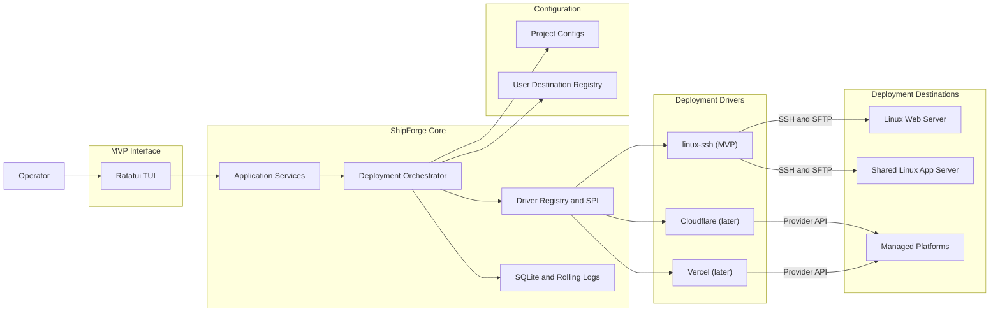
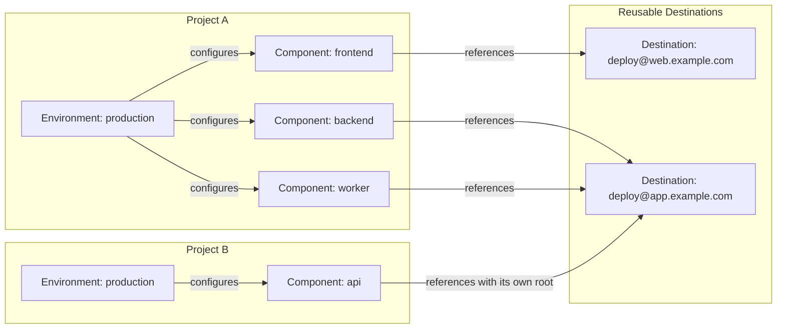

# ShipForge Architecture

## Goals and Boundaries

ShipForge is a local Rust executable that builds Components and deploys them through capability-based Drivers. A reusable Destination may be a Linux host reached by SSH or, after the MVP, a managed platform account; each Environment configures its Components directly with a Destination and deployment settings.

The MVP ships only the built-in `linux-ssh` Driver. Each Component selects exactly one Destination in an Environment, while several Components may reuse the same Destination with independent roots. One Component cannot be replicated across Destinations; rolling rollout, distributed atomicity, multi-process deployment coordination, external Driver plugins, AI Agent control, and automated database rollback are outside the MVP. AI Agent support is frozen: the MVP reserves no adapter, schema, protocol, or roadmap work package for it. SSH Agent remains only an authentication option.

## System Shape



The orchestrator owns Deployment status, Destination resolution, local build, canonical Release packaging, durable intent, ordered events, cross-Component sequencing, common health policy, and history. A Driver owns destination authentication, preflight, transfer or provider submission, activation, observation, rollback, remote logs, and cleanup. SSH/SFTP and vendor APIs are Driver implementation details, not application-layer protocols.

## Driver Contract

The internal Rust SPI is capability-based. Its conceptual contract is:

```rust
trait DeploymentDriver {
    fn kind(&self) -> DriverKind;
    fn static_capabilities(&self) -> DriverCapabilities;
    async fn preflight(&self, ctx: &ComponentExecutionContext) -> PreflightReport;
    async fn plan(&self, ctx: &ComponentExecutionContext,
        request: &ComponentRequest) -> ComponentPlan;
    async fn current(&self, ctx: &ComponentExecutionContext) -> Option<ReleaseRef>;
    async fn prepare(&self, deployment: &DeploymentId,
        ctx: &ComponentExecutionContext, plan: &ComponentPlan,
        package: &ReleasePackage, events: &dyn EventSink)
        -> PreparedRelease;
    async fn activate(&self, deployment: &DeploymentId, ctx: &ComponentExecutionContext,
        release: &ReleaseRef) -> ActivationReceipt;
    async fn rollback(&self, deployment: &DeploymentId, ctx: &ComponentExecutionContext,
        expected_current: Option<&ReleaseRef>, target: Option<&ReleaseRef>) -> ActivationReceipt;
    async fn logs(&self, ctx: &ComponentExecutionContext,
        release: &ReleaseRef) -> LogStream;
    async fn cleanup(&self, ctx: &ComponentExecutionContext,
        policy: &RetentionPolicy) -> CleanupReport;
}
```

Transport and SDK types—SSH sessions, SFTP handles, protocol errors, and provider request/response objects—remain inside a Driver. Application code receives only ShipForge-owned plans, events, errors, observations, Releases, and Release references. `ComponentExecutionContext` has a common identity envelope plus opaque credential and validated-target handles. Only `linux-ssh` interprets host/port/user/Host Key, root, systemd, and destination-side health settings; the application layer neither reads nor copies those fields into its domain model. `ReleaseRef` persists only common identity, version, Destination, endpoint, digest, and capability fields. Provider-specific IDs or SDK objects are not added to the MVP contract.

This boundary also applies to presentation and project configuration. The TUI says “SSH connection” and “deployment target”; `shipforge.yaml` contains no Driver field, capability identifier, transport option, or provider object. The user-level registry retains a private implementation tag so the program can select compiled code. Internal type names and diagnostic step IDs may identify a Driver, but ordinary TUI labels and Project YAML do not.

MVP Driver capabilities cover staged deployment, explicit activation, rollback, remote logs, retention, and cancellation. Local build and Release packaging are common application services, not Driver capabilities. Static capabilities are narrowed by preflight for the resolved Component target, and planning fails early when a required capability is absent. Provider build, preview URLs, promotion, and traffic splitting are designed only when the first managed-platform Driver is implemented.

Drivers are compiled into the executable and selected by the referenced Destination kind. Dynamic plugins and external Driver processes are outside the MVP and have no reserved protocol.

## Configuration Shape

The human-facing configuration rules are defined in `docs/configuration-guide.md`. The Project root contains one `shipforge.yaml`: concise user intent plus a TUI-maintained `_shipforge` section for stable Project/Environment identity, per-Component generation, and normalized target metadata such as the `linux-ssh` resolved root. The user-level registry records reusable Destination connections. Each Environment maps its Components directly to those Destinations.

The Project file lives at the selected Project root and is the sole source of Project identity and Project-specific deployment intent. The local Project registry stores only canonical root paths and recent-project metadata. Opening a root with a valid `shipforge.yaml` loads it directly; a missing file always starts new-Project setup and generates new identities. A present file with missing or invalid `_shipforge` metadata is rejected and may be reinitialized with new identities only after explicit user confirmation. Neither local cache nor remote state reconstructs Project configuration. Setup is selection-first: repository discovery proposes Components and builds, simple direct SSH config blocks propose connection values, and an authenticated Driver preflight proposes remote paths and services. Destination IDs and credential handles are generated automatically; credentials remain user-local and are never copied into the Project file.

The model keeps deployment stages separate from reusable infrastructure connections:



Destination connections live in the user's platform configuration directory, are reusable across Projects, and are managed by the TUI connection page rather than copied into Project files. The setup wizard can select an SSH config Host or create a connection through form fields and a Key picker.

Project configuration uses names and short forms; generated immutable Project/Environment IDs plus per-Component generations and resolved default roots live in `_shipforge`. YAML mapping order has no execution meaning, and optional Component `after` dependencies are topologically sorted with deterministic tie-breaking:

```yaml
schemaVersion: 1

_shipforge:
  projectId: prj_01J8MALL4Y2K6M7P
  environments:
    production:
      id: env_01J8PROD8V5F3Q1N
      components:
        frontend:
          generation: 1
          resolvedRoot: /srv/shipforge/mall/production/frontend
        backend:
          generation: 1
          resolvedRoot: /srv/shipforge/mall/production/backend
        worker:
          generation: 1
          resolvedRoot: /srv/shipforge/mall/production/worker

project: mall

components:
  frontend:
    build:
      - [npm, run, build]
    artifact: dist

  backend:
    build:
      - [cargo, build, --release]
    artifact: target/release/api

  worker:
    build:
      - [cargo, build, --release]
    artifact: target/release/worker

environments:
  production:
    components:
      frontend:
        to: dst_00000000000000000000000000000001
      backend:
        to: dst_00000000000000000000000000000002
        systemd: mall-api.service
        health: http://127.0.0.1:8080/health
      worker:
        to: dst_00000000000000000000000000000002
        systemd: mall-worker.service
```

The TUI writes one canonical YAML shape: `build` is always an ordered list of argv arrays, and `artifact` is always one relative path. The configuration layer applies defaults and creates typed values before invoking application services or Drivers. Build-output type is detected after the build and frozen into the Deployment Plan without another user field. Project, Environment, Destination, credential, Deployment, and Release identifiers are generated by the application and never derived from display text. Invalid references, paths, cycles, or managed metadata never mutate `shipforge.yaml`. Only a user-confirmed TUI edit atomically replaces the file.

Destination configuration is a versioned tagged union validated internally by its Driver. A system-generated immutable Destination ID identifies the connection; the TUI derives its display text from the endpoint. Referenced non-secret revisions remain available for historical observation and cleanup, while credentials resolve through current handles. Secret values are never serialized into Project configuration or plans. Each Environment/Component entry selects a Destination ID and provides only concise deployment settings. For `linux-ssh`, those settings include root, service activation, and health checks. Its default root is `/srv/shipforge/<project>/<environment>/<component>` and is materialized into `_shipforge`, so later Project or Environment renames do not retarget it. Changing the selected Destination or target settings increments the Component generation; editing the Destination connection itself creates a new Destination revision.

## Rust Layout

```text
src/
├── main.rs              # composition root, TUI startup, terminal restoration
├── tui/                 # ratatui views, input, bounded projection
├── application/         # orchestration, rollback, recovery, queries
├── domain/              # deployments, releases, destinations, components
├── drivers/
│   └── linux_ssh/       # MVP Deployment Driver
├── config/              # project config + Destination registry resolution
├── projects/            # local project registry
├── history/             # durable journal, logs, reconciliation
└── telemetry/           # ordered events and redaction
```

Application code depends on the Driver SPI, never on `linux_ssh`, SSH/SFTP, or vendor clients. Drivers may reuse low-level HTTP, process, archive, and credential adapters.

## Domain Lifecycles

A **Deployment** is an attempted change to one or more selected Components in an Environment. It exists before building and records each Component plan and outcome:

```text
created → running → succeeded
                  ├→ failed
                  └→ cancelled
```

Detailed progress is expressed by common and Driver-namespaced Steps. The configured `artifact` is one file or directory build-output path. The core Packager turns it into exactly one canonical deployable product: an immutable `<version>.tar.gz` **Release** for one Component, containing a minimal manifest and verified by SHA-256. The manifest contains stable identity, version, creation time, and source revision; archive size and digest are computed from the final bytes and stored beside the manifest data in the Release receipt, avoiding a self-referential digest. Drivers consume that Release and never create an alternative core package. A Deployment can produce several Releases, but it is not itself a Release and does not create an Environment snapshot. Each Component independently has a current Release or no deployed Release.

Cross-Component runtime dependencies use optional `after` edges within one Environment. The planner restricts the graph to the selected Components and sorts it with deterministic tie-breaking; an unselected dependency is not deployed automatically. The MVP prepares every selected Release first and, on failure, compensates already activated Components in reverse actual activation order. Environment Observation is a simple map from each configured Component to its observed current Release or `not_deployed`; it makes no environment-wide atomicity claim.

The application orchestrator accepts frozen Component plans, their sealed Release packages, and the planner's exact activation order. It rejects duplicate, missing, or cross-Project/Environment inputs before creating a Deployment. Each prepare, activation, and compensation call receives a durable intent first. A prepare receipt must preserve the full planned Release identity and capability snapshot. An activation error triggers a fresh observation: if the candidate is current it joins compensation; if another Release is observed, the orchestrator records that fact without blindly overwriting it. Recovery calls use a fresh cancellation token, and compensation failures retain the Driver's suggested manual action in the Deployment report.

Automatic compensation remains part of the failed or cancelled Deployment. An explicit rollback creates a separately linked Rollback Deployment, preflights every selected Component before changing anything, then processes the selected dependency graph in reverse activation order. Each target is either a frozen historical `ReleaseRef` or `not_deployed`; the Driver also receives the expected source, so absence is checked rather than treated as a wildcard. A partial rollback failure is observed with an independent bounded token; observation errors remain unknown and include manual guidance, never a fabricated `not_deployed` result. SQLite schema version 4 retains version 3's operation type, source Deployment link and nullable rollback target, and adds the bounded per-Deployment log index.

The TUI deployment service freezes Git branch/revision/worktree status and the selected configuration for confirmation. It creates the Deployment and build intent before invoking any build, then uses that same ID for preparation, activation, compensation and logs. Before each Driver mutation, a wrapper revalidates the saved Project and selected Destination snapshots; read-only observation of the frozen endpoint remains available after configuration drift. Terminal input/render errors request cancellation and wait for the running operation before closing the runtime.

## Linux SSH Driver

The first driver implements the existing agentless Linux workflow:

```text
local build → tar.gz + SHA-256 → SFTP temporary upload
→ versioned Component Release archive → extracted version directory
→ atomic Component current symlink → service activation → health checks
```

```text
<component.root>/
├── .shipforge-project.json
├── current -> releases/<version>/
├── archives/<version>.tar.gz
├── releases/<version>/
│   ├── manifest.json
│   └── <extracted payload>
├── temporary/<deployment-id>.tar.gz
└── metadata/{deployments,releases}.jsonl
```

The Driver verifies SSH Host Keys, remote tools, hashes, paths, disk, permissions, endpoint fingerprints, Component generations, and same-filesystem activation. `.shipforge-project.json` is a static Deployment Marker containing Project/Environment IDs, Component name, and generation; preflight rejects a conflict. It is not application configuration or a runtime dependency. Before preparation writes, the Driver rechecks `current` against the frozen plan and estimates peak storage from the existing archive's actual entries, remote block size, and metadata reserve. This is a point-in-time check, not a space reservation. Marker, path ancestors and internal directories reject unsafe links; current and historical manifests must match identity and version. The Driver uploads the already packaged Release, verifies its digest, and hard-links the verified bytes into `archives/<version>.tar.gz` with no-clobber semantics. It extracts first into `temporary/<deployment>.dir`, validates the embedded manifest, then uses a same-filesystem no-clobber rename into `releases/<version>`. The sealed Prepare receipt is bound to that Deployment. Prepare never creates or rewrites the archive and does not touch `current`.

Prepare may create only recorded, disposable staged resources for candidate Releases. Those writes must be retryable or cleanable and must not change `current`, services, databases, or business state. Shared persistent-content mapping is outside the MVP. After atomically switching each selected Component's `current`, the Driver activates and checks it in normalized dependency order; unselected Components are untouched.

Filesystem activation is atomic per Component, not across Components or an Environment. Observation accepts only a non-dangling `current -> releases/<version>` link whose version directory is not itself a link. Activation verifies the prepared archive and directory types, dereferences filesystem identities, checks expected `current` both before and after creating a Deployment-specific temporary link, then renames that link over `current`. After this switch, service completion and compensation use independent bounded tokens so user cancellation cannot strand half-finished recovery. Compensation re-observes `current` and refuses to overwrite drift. MVP checks include Destination-side HTTP/HTTPS and systemd stability. A service with no HTTP endpoint relies on its systemd stability check; custom command checks are deferred. If a Component fails, the Driver restores that Component's previous `current`; if none existed, it removes the new link and stops the newly started service. Components already activated by the same Deployment are compensated in reverse order.

For `linux-ssh`, health execution remains inside the Driver boundary. A configured systemd unit must first reach `active`; its `NRestarts` value becomes the baseline and may not increase during the stability window. A configured health URL is requested by remote `curl`, so loopback and private endpoints remain checkable, and only 2xx responses pass. Commands use structured arguments, bounded SSH output and bounded sanitized errors; URL arguments are marked sensitive in diagnostics. Timeout, interval, attempts and stability duration have safe built-in MVP defaults and bounded programmatic overrides. Cancellation stops waiting, then health verification invokes activation compensation with an independent token.

Every effect has a durable intent record before execution and an outcome afterward. Each Component activation remembers its prior `current` link, including absence. Restart or health failure invokes compensation inside the current Deployment. An explicit rollback uses a linked Rollback Deployment. The active TUI session refuses to start a second Deployment while one is running. Separate ShipForge processes are outside the supported operating model. Before an effect, the Driver verifies that the observed Destination revision, endpoint fingerprint, Component generation, and current version still match the plan; a mismatch stops the operation and asks the user to refresh.

## Persistence and Recovery

SQLite is authoritative for local Deployment intent, Steps, per-Component Release receipts and observations, logs, and recovery progress. Numbered migrations run transactionally and reject newer schemas. Deployment state updates use compare-and-set semantics; each external effect requires a pending intent row before execution and exactly one redacted outcome afterward. SQLite uses foreign keys, WAL, and full synchronous durability. Raw sanitized output drains into per-Deployment bounded rolling files; Unix database and log files use mode `0600`. UI notifications use bounded channels and may coalesce progress; terminal states and errors are never dropped.

Live build output is redacted across chunk boundaries before reaching disk or UI. A dedicated writer consumes a bounded queue; saturation or I/O failure requests safe cancellation and preserves the first diagnostic. Logs use a 1 MiB current file and up to three rotated files per Deployment. The UI projection has separate length/window limits. Final log failure is appended as a warning to an existing Deployment report and must not replace known outcomes or hide compensation failures. History browsing/export and recovery remain M2/M3 work.

Each Driver defines how to observe actual Component state. For `linux-ssh`, each Component's `current` link, archive, extracted directory, and manifest are authoritative; JSONL is an audit aid. Future managed Drivers use provider APIs and external IDs. Given a valid `shipforge.yaml`, recovery compares durable local intent with Driver observations and may rebuild the Component Release inventory; it never reconstructs Project identity or configuration from remote data. A failed multi-Component Deployment keeps explicit results for every selected Component until compensation or manual repair completes.

ShipForge's responsibility ends after activation, health verification, and durable result recording. The SSH session is then closed and no resident control process remains. Application processes and system services do not read ShipForge metadata. A later ShipForge session reconnects and observes the static remote facts only when the user starts another deployment, rollback, or recovery action.

## Runtime and TUI

One async runtime owns subprocesses, drivers, timers, cancellation, persistence, and ordered events. One in-memory `DeploymentSession` gate is owned by the TUI session and wraps both deploy and explicit rollback operations. A second operation is rejected before its future is polled; completion, error, or task cancellation releases the gate by scope. It creates no lock file, remote lock, or cross-process coordination protocol. The TUI invokes application services rather than embedding deployment behavior in views. The MVP has one explicit SSH setup use case using ShipForge-owned request and result types; only its `linux-ssh` adapter owns SSH sessions, commands, Host Keys, root probes, and systemd discovery. This avoids leaking transport types without inventing a generic setup-form protocol before a second Driver exists. AI Agent and other automation interfaces are frozen and have no MVP adapter or configuration. The TUI retains a bounded log window and loads older records from storage.

`ratatui` builds frames off-screen and `crossterm` flushes changed cells through buffered output. Changing views never cancels a Deployment. While one is active, normal quit offers only return or safe cancellation; the MVP has no detach mode. A terminal guard restores raw mode, cursor, and alternate screen after normal exit, error, or panic.

## Verification Strategy

- Driver-neutral tests use a fake Driver to prove execution-context propagation, capability rejection, receipts, cancellation, ordered compensation, and partial Environment Observation behavior.
- Every Driver passes a shared contract suite proving that every operation honors Destination revision, endpoint fingerprint, Component generation, validated target settings, and effective capabilities.
- `linux-ssh` integration tests use disposable Linux Destinations and inject interruption around every remote effect.
- End-to-end tests cover independent Components sharing one Destination, file/directory build outputs producing the same Release format, Component order, health failure, rollback failure, second-Deployment rejection within one TUI session, endpoint/root drift, restart recovery, retention, and local database loss.
- No automated test may discover or contact a real Environment.

## Planned Provider Drivers

Cloudflare Pages Direct Upload accepts prebuilt assets and exposes deployment, history, log, and rollback APIs, making it the closest next driver to the local-build model: [Direct Upload](https://developers.cloudflare.com/pages/get-started/direct-upload/) and [Pages Deployments API](https://developers.cloudflare.com/api/resources/pages/subresources/projects/subresources/deployments/).

Cloudflare Workers remains separate because it distinguishes uploaded Versions from traffic-serving Deployments and may support split traffic: [Workers versions and deployments](https://developers.cloudflare.com/workers/versions-and-deployments/).

Vercel can upload files by digest, create Deployments, promote a deployment to Current, and roll back eligible production deployments: [deployment overview](https://vercel.com/docs/deployments/overview), [promoting deployments](https://vercel.com/docs/deployments/promoting-a-deployment), and [instant rollback](https://vercel.com/docs/instant-rollback).
